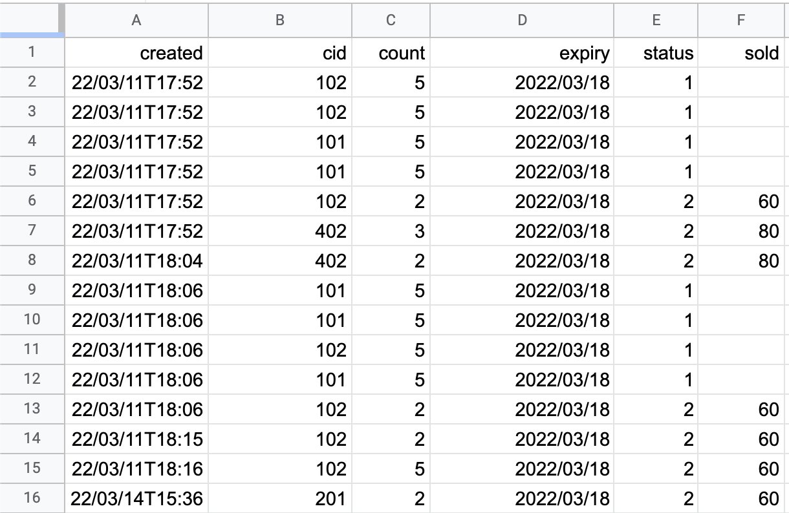

## 進銷存系統 POS System

- 入庫：從物業收貨時，紀錄商品入庫資訊：
  - 品項、細目
  - 數量、金額
  - 即期日、折扣
- 結帳：客戶購買商品時，紀錄銷售資訊
  - 當前庫存數量
  - 要區分不同即期日之商品
- 查詢：
  - 當前庫存數量
  - 當日結帳清單、營收，可切換日期區間

 

## Tech Stack

- 使用 React Ant Design UI 建置庫存管理、進貨等功能。
- 使用 Express.js, Google Sheet 做為資料庫。
  

    
  

- 前後端分離，後端另外部署至 heroku，設定 CORS 和 request 來源。
- 在切換頁面時，使用 AbortController 取消撈取 API。

 

## Available Scripts

`npm run firebase`：react-scripts build firebase deploy. (分支 master)
 
[firebase web link](https://sheet1218.web.app/)

`npm run deploy`：react-scripts build and deploy to github. (設定有差異、分支 deploy2github)
 
[github web link](kero13ro.github.io/pos-gin/)

[V] 瓶裝預定每次 50 瓶 
[V] 出貨時，共有五種狀態：售出、開瓶、折扣、破損、下架 
[ ] 每日盤點時，要能看到各品項的總瓶數 
[ ] 每日盤點時，要能看到今日到期數量、要手動點選下架 
[ ] 每月查詢，每日營業額，銷售數量、種類 
