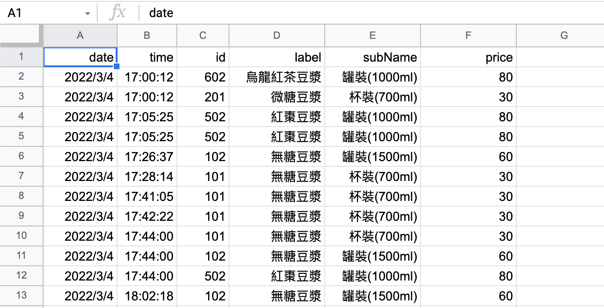

## 進銷存系統 POS System

- 使用 React Ant Design UI 建置庫存管理、進貨等功能。
- 使用 express, google sheet 做為資料庫。
- 考量 auth 驗證問題，前後端分離，另外部署至 heroku。
  

 

## Product Requirement Document

- 入庫：從物業收貨時，紀錄商品入庫資訊，包括品項、數量、即期日
- 結帳：客戶購買商品時，紀錄銷售資訊
- 查詢：
  - 當前庫存數量
  - 當日結帳清單、營收，可切換日期區間

 

## Todo

- [x] 結帳：可選擇各品項、統整金額和數量
- [x] 寫入 Google Sheet
- [ ] 入庫：依據不同日期，區分即期品，自動折扣
- [ ] 查詢當日營業額、庫存

## Available Scripts

`npm run deploy`：react-scripts build and deploy to github.
